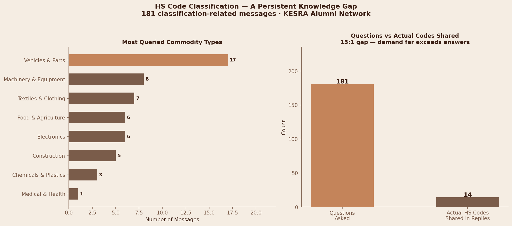

# KESRA Logistics Analysis

Overview

Analysis of 10,532 messages from a 652-member WhatsApp community of Kenya customs 
and logistics professionals, spanning July 2024 – June 2026.

The goal

extract structured intelligence from two years of unstructured
conversations to identify operational pain points in East African trade and logistics.

The Problem

East African logistics professionals lack a centralised knowledge base for customs 
classification and trade corridor intelligence. This analysis quantifies that gap 
using real community data.

Key Findings

| Customs Clearance is the #1 point | 622 messages — most discussed topic 

| HS Code classification gap | 181 questions asked, only 14 codes shared — 13:1 gap 

| Dominant trade corridor | Mombasa (463) → Nairobi (340) → Uganda (105) 

| Network activity peak | February 2025 — 897 messages in one month 

| Industry operating rhythm | Tuesday is peak day — 2,204 messages over 2 years 

Dashboard

HS Code Analysis

Tools
Python · pandas · Matplotlib · Seaborn · regex · Jupyter Notebook

Privacy Note
Raw WhatsApp data is not included in this repository to protect member privacy.

Author
**Joylynn Mumbi Ngari** — Data Analyst, Supply Chain & Logistics  
[linkedin.com/in/joylynnngari](https://linkedin.com/in/joylynnngari) · [github.com/Joylynn-tech](https://github.com/Joylynn-tech)
